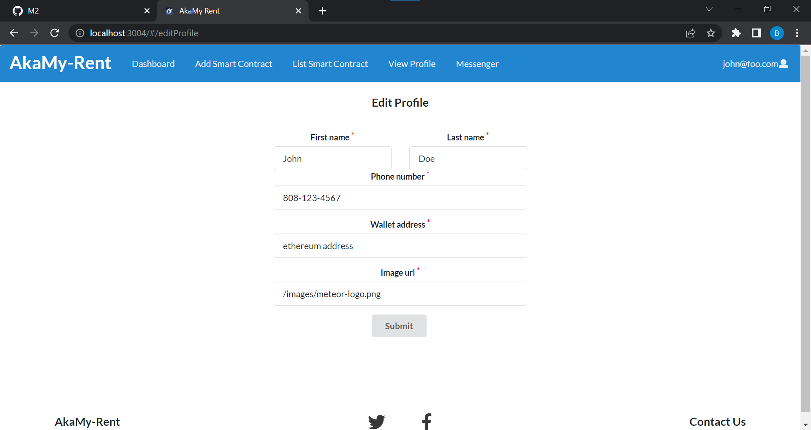
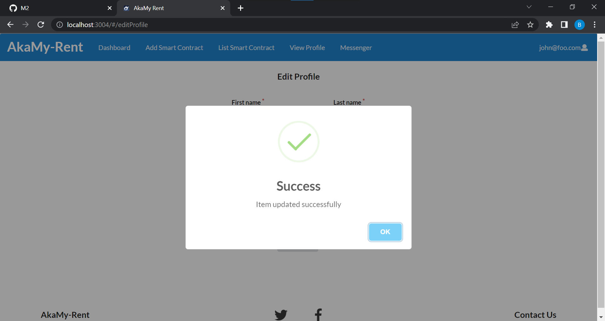
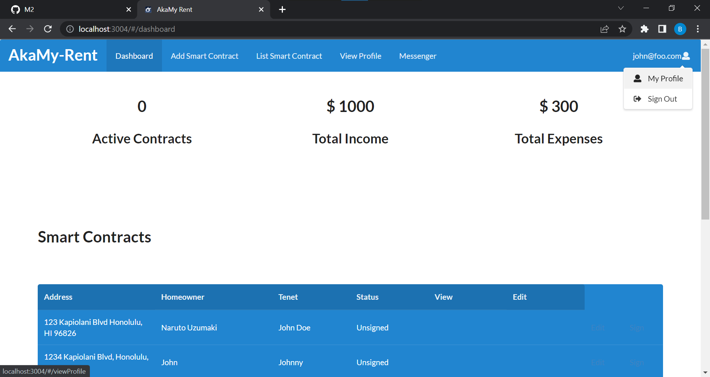
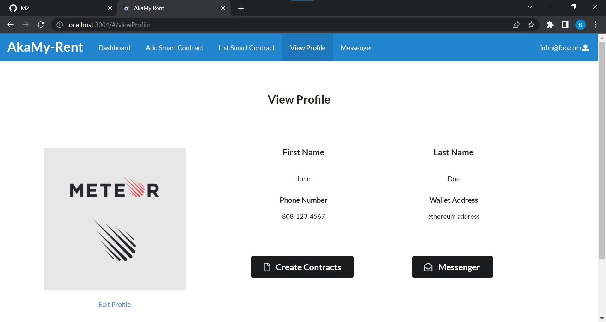

### Editing Profile Page
Once the user creates a new account, they are directly prompted to the edit profile page filled with default placeholder values.

Then, they can make the necessary changes to the form fields and can confirm the changes have been submitted successfully by the following alert.

### Viewing User's Profile
Whenever users are on different window and wanted to view their profile, they can go to the top right corner and click on the dropdown menu to select view profile.

This will then directly take them to the view profile page. Users also have the option to navigate to different windows including the edit profile page.

